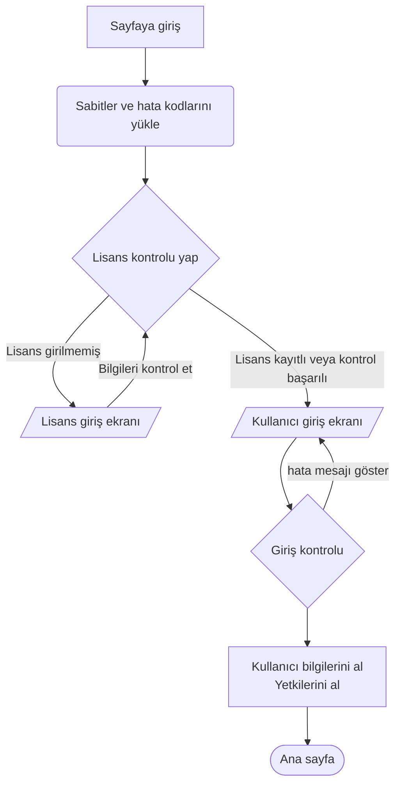

# yapılacak işlemleri

ilk sayfa yüklenirken bazı istekler yapılmalı
* dil bilgisi /language
* sabitler /const 
* hata kodları /errorcode
* csrf token istenmeli /getcsrftoken

## lisans kontrolu
    * lisans kontrolu yapılmalı /check-licence
    
## lisans kontrolu başarılı ise login sayfasına yönlendirilmeli.
    * hatalı lisans işleminde sayfa uyarı verip sabit kalmalı.

## Login sayfası çıkmalı
    * login işlemi pina store yardımı ile yapılacak
    * başarılı girişte token pina store ile saklanmalı
    * kullanıcı profil bilgisi için /me isteği atılmalı

## başarılı login işleminden sonra
    * kullanıcıya göre layout yüklenmeli
    * Sabit düzenler yüklenmeli  /dashboard/default
    * home page düzeni istenmeli /dashboard/home

## sol menu düzeni
    * kullanıcı izinlerine göre sol menü düzenlenmeli.
## ust menü 
    * kullanıcı yetkilerine göre düzenlenemeli

## dasboard düzenleme
    * her sayfa layoutGrid desteği ile düzenlenebilmeli.
    * düzen kullanıcı bazlı saklanmalı /dashboad/custome/save

# sistem genelinde kullanılacak fonksiyonlar
 * isAuthanticate
 * isCan
 * isLang
 * changeLang
 * tokenRefresh
 * login
 * logout

